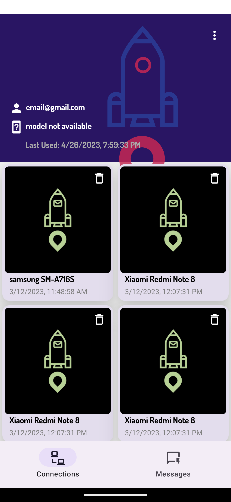

# Sendit with React Native

This project is a clone of the original Sendit app created by thesiamak (https://github.com/thesiamak/sendit). The goal of this project is to implement a minimal viable product (MVP) of Sendit using React Native and compare it with the original Kotlin-based implementation.

## Article
Read this for more info and comparison details:
https://medium.com/@the_siamak/react-native-vs-android-a-comprehensive-comparison-c2fddea0c803

## Features

### The following features have been implemented in this app:

1. Integration with Google authentication and single sign-on.
2. Integration with Firebase services, including messaging and analytics.
3. System notifications for new messages.
4. Send and receive text between devices owned by the user.
5. Generate and scan QR codes to connect devices.
6. User authentication and authorization system.
7. Database and local storage for messages and device connections.
8. Error handling and job interception for better user experience.

### The following features have not been implemented in this MVP:

1. Sign up with username and password.
2. Password reset functionality.
3. Ability to share received text with other apps.
4. Delete device from the user's account.
5. Redirection to websites.
6. Some UI/layout animations.
7. Splash screen (React Native has a default splash screen).

## Screenshots
    

## React Native Technologies Used

### The following React Native technologies have been used in this project:

1. Basic widgets for creating the UI.
2. Custom UI and headless components.
3. Custom JavaScript bridge to communicate between native and cross-platform code.
4. React Navigation for navigation and authentication system.
5. Network API handling with separate components and a pub/sub system.
6. Dependency injection via parameters.
7. Complex UI design with custom and provided widgets.
8. Redux toolkit and database for state management.
9. React Native Firebase (https://rnfirebase.io/) for Firebase integration.
10. React Navigation (https://reactnavigation.org/) for navigation.

## Installation

To run the app, you need to have React Native and its dependencies installed. Clone the repository and run `npm install` to install the required packages. Then run `npm start` to start the app. The app can be run on iOS and Android devices or emulators.

## Contributing

Contributions to this project are welcome. To contribute, please fork the repository and create a pull request with your changes.
